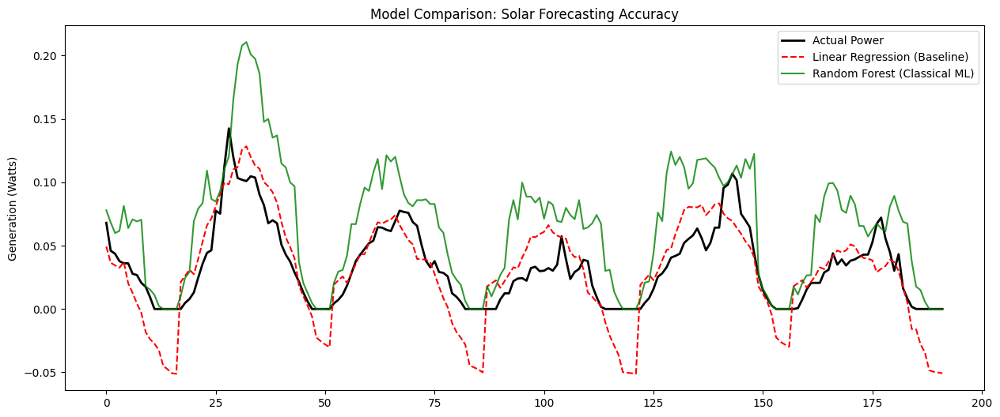
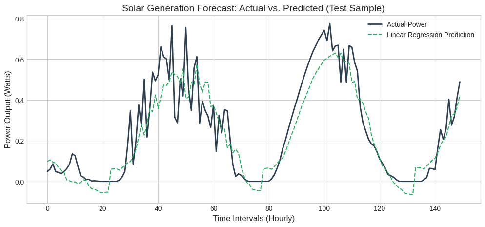
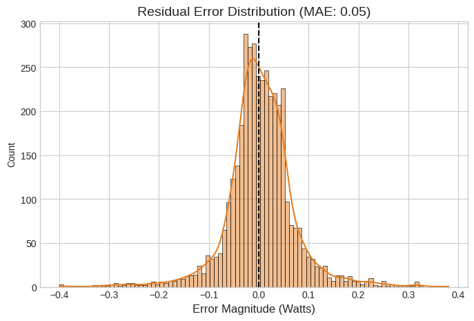
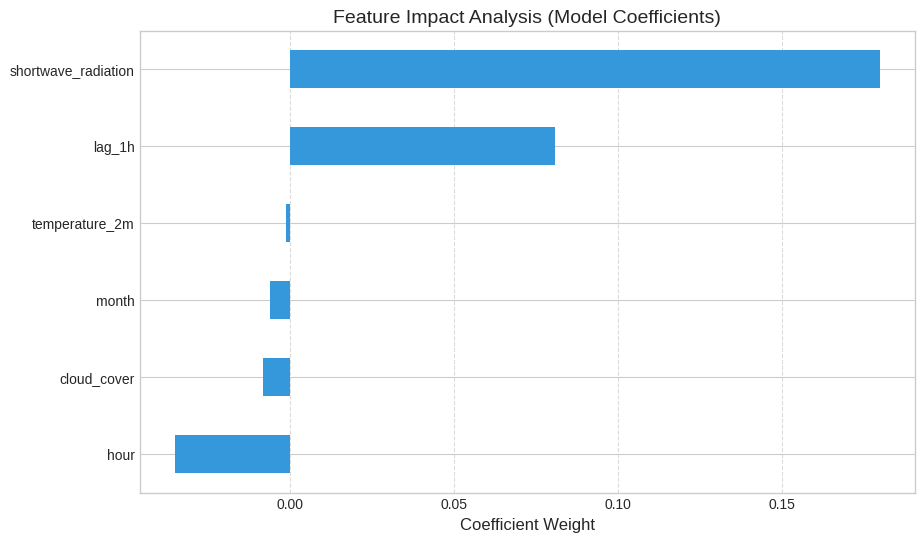

# HeliosCast: Solar Energy Forecasting

A machine learning system for forecasting solar power generation using meteorological data and temporal features. Achieves an R² score of 0.8043 with a production-ready pipeline deployed on Streamlit.

## Introduction

As the global energy grid transitions toward renewables, the inherent intermittency of solar energy poses a challenge to grid stability. HeliosCast addresses this by providing high-accuracy short-term forecasts. The system predicts power output based on atmospheric variables and historical state.

## System Architecture

The HeliosCast system follows a production-oriented machine learning lifecycle. The system is modularized into four critical stages: Data Acquisition, Feature Engineering, the Inference Engine, and the deployment UI via Streamlit interface. This architecture ensures computational efficiency and model interpretability.


The diagram highlights the decision process where the Linear Regression path, augmented by temporal features (Hour/Month) and autoregressive memory (lag 1h), was prioritized over the Random Forest comparison model due to superior generalization on the linear irradiance profile.

## Methodology

### Data Alignment

We utilized the OpenSTEF dataset. A critical challenge was the frequency mismatch between weather (60-min) and power (15-min) data. This was resolved using a merge strategy to ensure temporal alignment without data leakage.

### Feature Engineering

Solar generation is highly cyclical. We transformed raw timestamps into:
- Diurnal Factor: The hour feature to map the daily sun path.
- Seasonal Factor: The month feature to account for variance in day length.
- Autoregressive Component: A 1-hour lag to provide short-term continuity.

## Model Comparison and Selection

Before finalizing the production model, a comparison was conducted between a non-linear ensemble (Random Forest) and a linear model.



| Model | R² Score | MAE |
|-------|----------|-----|
| Linear Regression (Selected) | 0.8043 | 0.05 W |
| Random Forest Regressor | 0.7569 | 0.05 W |

Linear Regression was selected as it demonstrated better generalization. The direct physical relationship between irradiance and photovoltaic output favored the linear approach over the more complex ensemble.

## Results and Performance Analysis

The performance of the Multiple Linear Regression model was evaluated using key metrics.

| Metric | Value |
|--------|-------|
| R² Score | 0.8043 |
| MAE | 0.05 W |
| RMSE | 0.07 W |

## Visual Performance Analysis







## Features

- **Real-Time Forecast**: Manual input for individual scenario simulation
- **Batch Processing**: Upload CSV files for bulk forecasting
- **Model Metrics**: View training insights and performance analysis
- **Interactive Dashboard**: Built with Streamlit for easy deployment

## Installation

1. Clone the repository:
   ```bash
   git clone https://github.com/agrawalshreyansh/HeliosCast
   cd HeliosCast
   ```

2. Install dependencies:
   ```bash
   pip install -r requirements.txt
   ```

3. Place the model files (`solar_model.pkl`, `scaler.pkl`) in the project directory.

## Usage

Run the Streamlit app:
```bash
streamlit run app.py
```

Navigate through the sidebar tabs to:
- Enter parameters for real-time prediction
- Upload CSV for batch processing
- View model performance metrics

## Conclusion

The HeliosCast system successfully validates that Multiple Linear Regression, when augmented with temporal and lag features, is a highly efficient tool for solar forecasting. The system provides an interpretable, low-latency solution for modern energy management.

